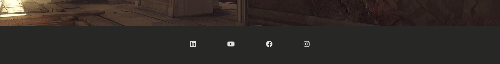

# Portfolio Project 1 - 3D Artist Personal Website

The purpose of this website is to promote my brother's 3D work porttfolio. The main goal of this project is to demostrate my knowledge acquired throughout the course in HTML and CSS.

This site is aimed to advertise his services to video game companies, and companies or people that may require of similar services.

Users will find details about his rofile, his work, and a contact information form.

## Features
---

### - Navigation

My project consists of four webpages:

- Home or landing page, display the main image of the artist work; this page speaks for itself, it aims to give to user a first time view of the quality of his work.
- Profile page, describe the artist knowledge and capability to work with different platforms and systems related to his industry.
- Gallery page, highlights various images of the artist work.
- Contact page, gives the option to the user to contact him via email, additionally they can include their phone number, please note this field is optional.

### - The Navigation Bar

- The naviagation bar is located at the top of the page, displays the the artist name and role in the left corner.
- The other navigation links are on the to right hand side: Home, Profile, Gallery, Contact which link to different sections of the same page.
- The navigation bar is very responsive and user friendly, allows the user to find information easily in each section of the website.

### - The Home Page

- Home or landing page, display the main image of the artist work; this page speaks for itself, it aims to give to user a first time view of the quality of his work.

### - The Profile Page

- Profile page, describe the artist knowledge and capability to work with different platforms and systems related to his industry.

### - The Gallery Page

- Gallery page, highlights various images of the artist work.

### - The Contact Page

- Contact page, gives the option to the user to contact him via email, additionally they can include their phone number, please note this field is optional.

### - The Footer

- The footer section includes links to the relevant social media sites of the artist. The links open to a new tab to allow easy navigation for the user.

## Testing
---

- I tested this page in different web browsers such as: Chrome, Firefox, Safari.
- I confirmed that this project is responsive, looks good and functions on all standard screen sizes using the DevTools device toolbar.
- I confirmed that the navigation, header, home, profile, gallery, and contact text are all rideable and easy to understand.
- I confirmed that the form works. It requires entries in every field, will only accept an email in the email field, and the submit button works.

## Bugs

### Solved bugs

- While testing the navegation menu before deploying my project to github, I noticed there was a problem when clicking on the profile menu from the contact one; instead of taking me to the correct destination, it took me to the home page instead.
- I discovered this was due when I copied the initial index.html file to the contact one, I forgot to update the href to "profile.html" within anchor element.
- Please refer below the code updated:

## Validator Testing

### HTML

### CSS

### Accessibility

- I confirmed that the colors and fonts chosen are easy to read and accessible by running lighthouse in DevTools.

### Deployment

The site was deployed to GitHub pages. The steps to deploy are:

- In the GitHub repository, navigate to the Settings tab.
- From the source section drop-down menu, select the Master Branch.
- Once the Master Branch has been selected, the page provided the link to the completed website.

The live link ca be found here -

## Credits

## Content

- The main idea for the layout of the website, contact form and  came from the Code Institute Love Running Project module, I had no previous experience building a website and doing this project previous my solo one was of a huge help, thank you Code Institute.
- The icons in the footer were taken from [Font Awesome](https://fontawesome.com/)
- A big thank you to my brother Cristian Leon, for allowing me to use his images and content profile, I must say his passion for what he does has inspired me to pursue this new path in web development.

## Media

- All images in the website were provided from Cristian Leon.

## Acknowledgements

- The README template provided y Code Institute on the sample project README.md from "Project Portfolio 1"
- The online tutors.
- All the slackers from the slack community.
- My classmates: Tasha Johnson and Usman Khan.
- Code Institute student support team, for listening and all the encouragement provided through the course.
---

Happy coding!
