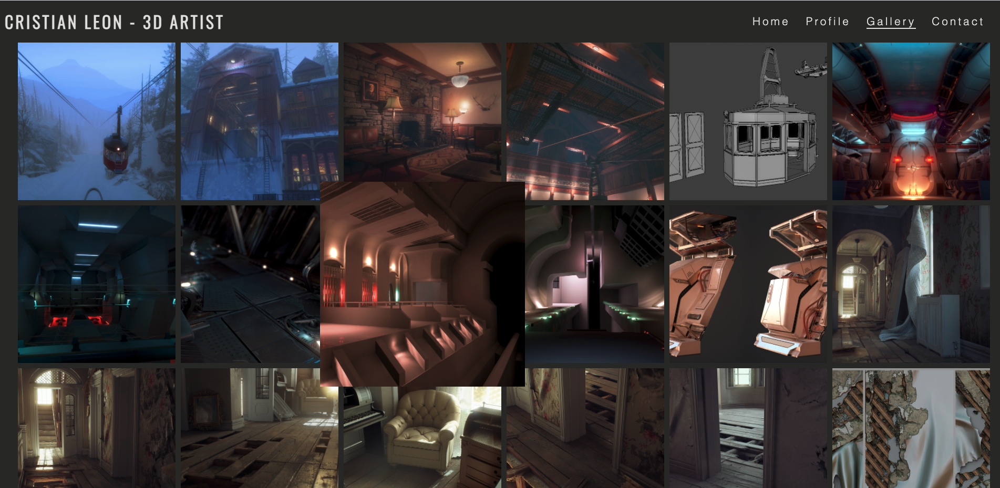
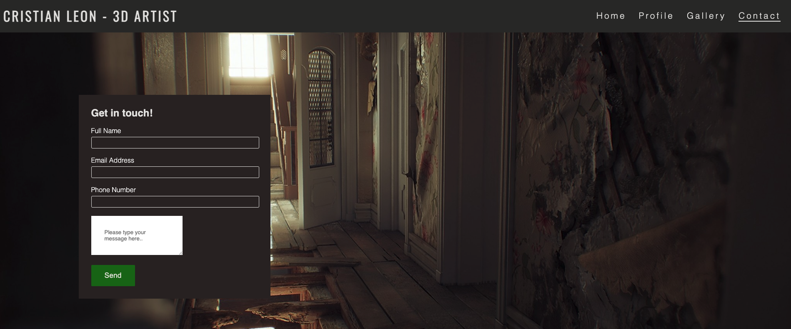

# Portfolio Project 1 - 3D Artist Personal Website

The purpose of this website is to promote my brother's 3D work porttfolio. The main goal of this project is to demonstrate my knowledge acquired throughout the course in HTML and CSS.

This site is aimed to advertise his services to video game companies, and people that may require of his services.

Users will be able to find details about his profile, work, and a contact information form section.

---

## Live Site

[Cristian Leon - 3D Artist](https://henryl74.github.io/3d-artist-personal-website/)

---
# Features

My project consists of four webpages:

- Home or landing page.
- Profile page.
- Gallery page.
- Contact page.

### - The Navigation Bar

- The naviagation bar is located at the top of the page, one section displays the artist name and role, this information is located on the left corner.
- The other navigation links of the website are on the top right hand side, these are: Home, Profile, Gallery, and Contact.
- The navigation bar is very responsive and user friendly, allows the user to find information easily in each section of the website.

### - The Home or Landing Page

- Home page, displays the main image of the artist work along with his name as a logo, this is located on the top left hand side corner; this page speaks for itself, it aims to give the user a first time view experience of the quality of his work.
- The user will find a welcome section with an overiew of the website and its content, this section is also supported by the foother social media links associated to the artist.

### - The Profile Page

- Profile page, displays the artist profile photo; and describes his knowledge and capability to work with different platforms and systems related to his industry.

### - The Gallery Page

- Gallery page, highlights various images of the artist work, some of them are sketches and some are personal projects for use of his portfolio.

### - The Contact Page

- Contact page, encourages the users to contact the artist.
- The contact form collects details of the user such as names, email address, telephone number and they can include a message as well.

- I tested the contact form with successful results when submitted.

- I tested the validation on the contact form and works very well, name, email and phone fields are mandatory preventing the user of leaving this black or without the required information.

### - The Footer

- The footer section includes links to the relevant social media sites associated to the artist. The links open to a new tab to allow easy navigation for the user.

## Testing
---

- I tested this page in different web browsers such as: Chrome, Firefox, Safari on desktop and mobile phones respectively.
- I confirmed that this project is responsive, looks good and functions on all standard screen sizes using the DevTools device toolbar.
- I confirmed that the navigation, header, home, profile, gallery, and contact text are all readable and easy to understand.
- I confirmed that the form works. It requires entries in every field (excluding the message), will only accept an email in the email field, and the submit button works.

### Google Chrome Browser

### Safari Browser

### Firefox Mobile Browser

## Bugs

### Solved bugs

- While testing the navegation menu before deploying my project to github, I noticed there was a problem when clicking on the profile menu from the contact one; instead of taking me to the correct destination, it took me to the home page instead.
- I discovered this was due when I copied the initial index.html file to the contact one, I forgot to update the href to "profile.html" within the anchor element.

- The box I created for the profile page was out alignment at top, this due the "float left" I applied to the logo/header in my css file.
- I solved this by applying "clear left" to the box profile ID:

- The "Home" image was a little heavy and affected somehow the score for performance in lighthouse for this section of the website, I fixed this by converting the file to jpeg and reducing the size.

### Unfixed Bugs

- Due to time constraints I could not test the site for all type of mobile phones, the site works very well in most mobile standard devices, laptops and desktop computer.

## Validator Testing

### HTML

- The first time I run the html in W3C, it returned with a few errors encountered in the title of the images, I fixed this by renaming the images title by using underscore to eliminate any existing space from the name; run the html files again and this time no errors were returned when passing through the official W3C validator.

### CSS

- No errors were found when passing through the official (Jigsaw) validator.

### Accessibility

- I confirmed that the colors and fonts chosen are easy to read and accessible by running lighthouse in DevTools.

### Desktop

### Mobile

### Deployment

The site was deployed to GitHub pages. The steps to deploy are:

- In the GitHub repository, navigate to the Settings tab.
- On the GitHub Pages section clicked on the pages settings dedicated tab link.
- From the source section drop-down menu, select the Main Branch click on seve.
- Once the Main Branch has been selected and saved, the page provided the link to the completed website.

The live link ca be found here: [Cristian Leon - 3D Artist](https://henryl74.github.io/3d-artist-personal-website/)

----
# Credits

## Content

- The main idea for the layout of the website and contact form came from the Code Institute Love Running Project module. I had no previous experience building a website and doing this project first was a huge help, thank you Code Institute.
- The icons in the footer were taken from [Font Awesome](https://fontawesome.com/)
- A big thank you to my brother Cristian Leon, for allowing me to use his images and content profile, I must say his passion for what he does has inspired me to pursue this new path in web development.

## Media

- All images in my website project were provided by Cristian Leon (the artist).

## Acknowledgements

- The README template provided y Code Institute on the sample project README.md from "Project Portfolio 1"
- The online tutors for all their help.
- The Code Institute slack community.
- Online tutorials about HTML and CSS.
- My classmates: Tasha Johnson and Usman Khan.
- My new mentor Chris Quinn, thank you for all your positive feedback and guidance given. 
- Last but not least Code Institute student support team, for listening to my concerns and for all their encouragement given.
---
